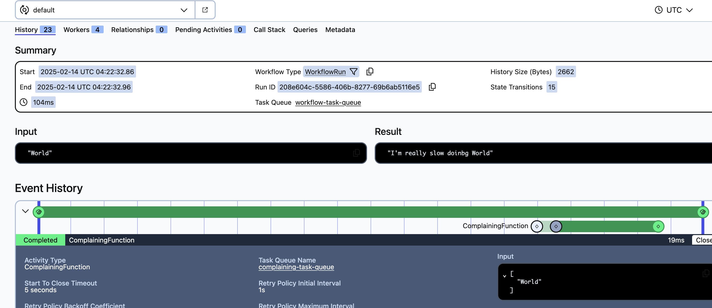

# Temporal using multiple task queues

This is a quick example of using different task queues to execute either activities, workflows or nexus task as 
documented [here](https://docs.temporal.io/task-queue)

By default the same task queue is used by the workflow and activity task if no task queue is specified for the 
activity.

If you need different task queues to run different task you will need a worker for each task queue and 
will need to register the tasks against that worker.

For example in the related sample code, there are 3 workers each related to a task queue:
- workflow-task-queue
- activity-task-queue
- complaining-task-queue

Each worker then registers the task that it is responsible for executing.

For example:
- The workflow worker that is created with the `workflow-task-queue` registers only the workflow against it 
and is therefore only responsible for polling and executing workflows from this queue
```
w.RegisterWorkflow(WorkflowRun)
```

- The activity worker created against the `activity-task-queue` is responsible for polling and
executing the below activities that are registered against it
```
w.RegisterActivity(ComposeGreeting)
w.RegisterActivity(AnotherFunction)
```
- Finally the complaining worker created with the `complaining-task-queue` is used to poll and process
a complaining activity that may be required to be throttled due to downstream constraints and registers the
complaining activity
```
w.RegisterActivity(ComplainingFunction)
```

Throttling of the worker can be done by supplying set options to it on creation,
further reading on what needs to be set can be looked at in the API doc [here](https://pkg.go.dev/go.temporal.io/sdk@v1.32.1/internal#WorkerOptions)

Currently the assumption is that we can set these two options
```
w := worker.New(cl, ComplainingTaskQueue, worker.Options{
    WorkerActivitiesPerSecond:    1,
    TaskQueueActivitiesPerSecond: 1,
})
```

If you currently have a single worker with a single task queue polling and processing all workflows and all your activities
and you have a requirement that certain activities need to be throttled due to downstream constraints/service availability,
theoretically refactoring to achieve usage or multiple task queues does not seem overly complex.

- Consider what activities needs to be separated and remove them from the current worker registration
- Create a new worker for each task queue you expect to use to poll/execute activities that need to be constrained
- Register the activities against the new workers accordingly
- Configure the worker options `WorkerActivitiesPerSecond` and/or `TaskQueueActivitiesPerSecond` as required
- Refactor the activity execution to use the new task queue 
```
newOptions := workflow.ActivityOptions{
	TaskQueue:           NewTaskQueue,
	StartToCloseTimeout: time.Second * 5,
}
newCtx := workflow.WithActivityOptions(ctx, newOptions)
err := workflow.ExecuteActivity(newCtx, ThrottledActivity, name).Get(ctx, &result)
```
- TEST!

The image below shows the workflow execution of the sample code. You can see the workflow
using one task queue `workflow-task-queue` and the complaining activity using another separate one `complaining-task-queue`
